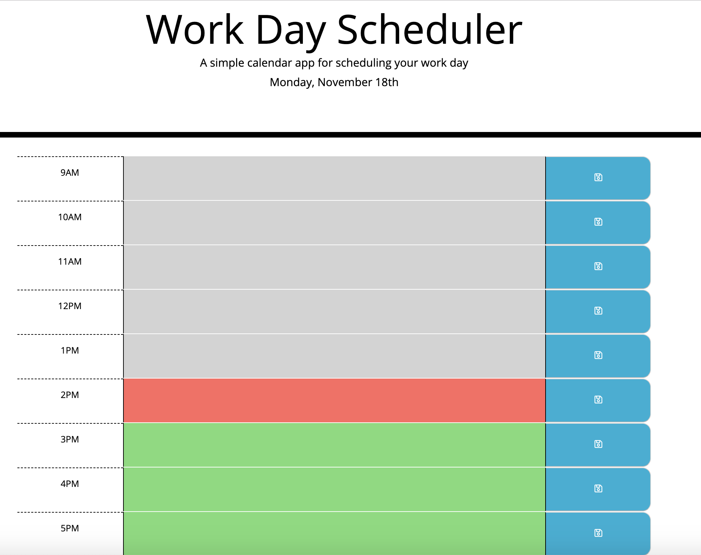
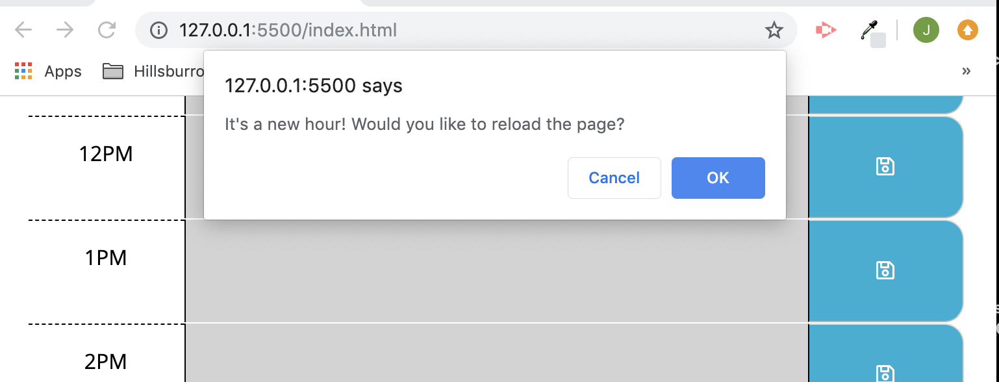
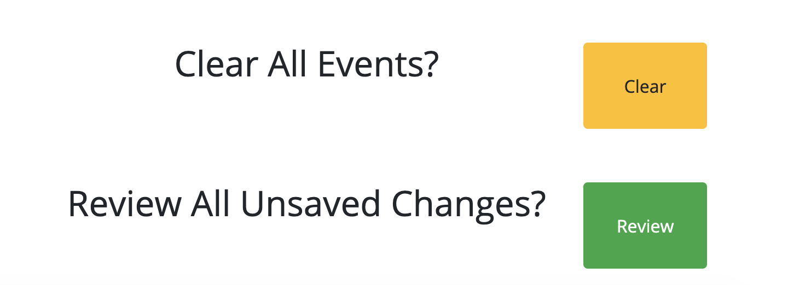

# DayPlanner
This web application functions as an event planner for a day of work.

## Installation

Clone folder onto your own computer by forking the repository and using the "Clone or download" button on github.  

## Functionality 

### Current time sensitivity
The calendar spans a workday from 9AM to 5PM. The current date is displayed at the top of the planner. Each work hour is color-coded based on the current time of day. Hours in the past are gray, the present hour is red, and future hours are green.  

### Automatic Reloading of page on the new hour
The page is set to reload on each new hour. Prior to reloading the page, a confirm asks the user if it is okay to reload. This is done in order to prevent unexpected loss of data. If the user confirms, the page reloads displaying the correct colors for each time block and resets the timer to load the page in an hour. If the user denies the reload, they must reload the page to restart this functionality. 

### Event Saving
When the user inputs a new event into an hour time block on the planner, she can save the event into local storage by clicking the blue save button to the right of the event. The save button will not work if only spaces are entered or no new event is added. If a new event is entered and the save button is not clicked, it will not be saved to local storage. 

When the page is re-visited, saved events are added to the planner from local storage. 

If a previously saved event is deleted and the save button is clicked, the user will be asked to confirm the clearing of the event. 

At the bottom of the planner, users can clear all of the previously saved events with the "Clear" button is pressed.

There is also a button for the user to review any unsaved changes. When clicked, any changes that were made to the planner and were not saved will be shown to the user and the user will be asked to confirm those changes. 

## Coding

This project utilizes javascript and css. A basic html template and styling sheet was created by Triology Coding Bootcamp. Bootstraps 4 was utilized for the styling and for media responsiveness. jQuery was used to select and mainpulate the DOM. Local storage was used to save event data. Moment.js was used to create the time responsiveness in the page. 

Of special note is the creation of the time-block elements. This was done with a for loop and jQuery to clone and append the HTML block I created for the 9AM time-block. 

## Meta 

Jamie Kook - kookjc6@gmail.com

[https://https://jamiekook.github.io/DayPlanner/](https://jamiekook.github.io/DayPlanner/)
